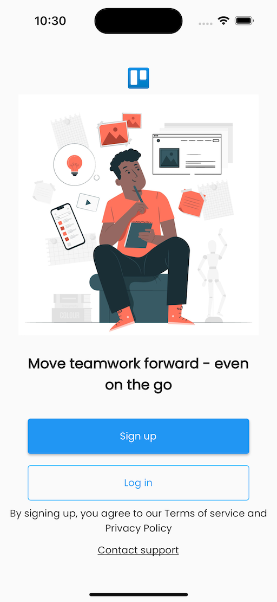

# Powersync + Flutter

## Introduction

Trello App Clone built with [Flutter](https://flutter.dev/) :star2: [Powersync](https://powersync.co/) and [Supabase](https://supabase.io/)



## Features

 - TODO

## Getting Started

First checkout out [the getting started guide](https://docs.powersync.co/integration-guides/supabase-+-powersync) for [Powersync](https://powersync.co/) and [Supabase](https://supabase.io/).

TODO: describe below steps from basic tut.
- [ ] Create Powersync & Supabase accounts

## Configuring Supabase
- [ ] Setup Supabase project

### Creating Database Tables
After creating the Supabase project, we still need to create the tables in the database. 

TODO: use `tables.sql` and explain how to run this in Supabase SQL editor
 
- [ ] Create tables in Supabase (using generated sql files)
- [ ] set email confirmation flow to false

### Create the Postgres Publication

PowerSync uses the Postgres [Write Ahead Log (WAL)](https://www.postgresql.org/docs/current/wal-intro.html) to replicate data changes in order to keep PowerSync SDK clients up to date.

Run the below SQL statement in your Supabase SQL Editor:
```sql
create publication powersync for table activity, attachment, board, card, checklist, comment, listboard, member, trellouser, workspace;
```

## Configuring PowerSync

TODO: create below instructions from basic tut
- [ ] Setup Powersync project 
- [ ] and connect to Supabase


### Configuring Sync Rules
- [ ] figure out how sync rules should look - enforce so that users see only their own data, as well as visible to workspace where they are members, or public workspaces
- [ ] Create sync rules in Powersync (see basic Powersync Tut)

TODO: explain permissions/visibility of workspaces, boards, etc in app

Step1: basic userId based rules (`sync-rules-1.yaml`)
Step2: add visibility rules (`sync-rules-2.yaml`)
Step3: add public workspace rules (`sync-rules-3.yaml`)

### Configuring Flutter App
- [ ] Configure Flutter app with powersync project settings (see basic Powersync Tut)

## Build process

- Follow the [Flutter Guide](https://flutter.dev/docs/get-started/install) to get started in building with Flutter.
- Run ``` flutter pub get ``` to install the necessary packages on your command line that's navigated to the root of the project.
- Invoke the ``` flutter run ``` command.

## Running the app

TODO

### Importing / Generating Data

TODO

## App Architecture

TODO: explain how it sticks together

1. overview of layers (app, client lib)
2. end-to-end discussion of how an entity is created, updated, deleted
3. discussion of watch query example
4. discussion of transaction example
5. discussion on IDs?
6. discussion on sync rules applied

## Feedback

- Feel free to send feedback . Feature requests are always welcome. If there's anything you'd like to chat about, please don't hesitate to [reach out to us](https://docs.powersync.co/resources/contact-us).


## Acknowledgements

This tutorial is based on the [Serverpod + Flutter Tutorial](https://github.com/Mobterest/serverpod_flutter_tutorial) by [Mobterest](https://www.instagram.com/mobterest/

# TODOs

- [X] Basic Powersync and Supabase setup
- [X] Create Supabase tables
- [X] Port Serverpod client code to Powersync client code
- [X] Update App code to user powersync client code
- [X] Test if it works with local db (sqlite)
- [X] Update to use Supabase Auth
- [ ] Tweak sync rules to enforce permissions (according to workspace + board visibility and members)
- [ ] Test if syncing works
- [ ] Look at using transactions
- [ ] Look at using watch queries
- [ ] Data generation (or import) functionality for testing bigger datasets
- [ ] (nice2have) improve logging
- [ ] (nice2have) get attachment uploads working with supabase
- [ ] (nice2have) implement email confirmation flow

## Possible next steps

* Email confirmation flow
* Update of password or email
* Enhancing UX of app